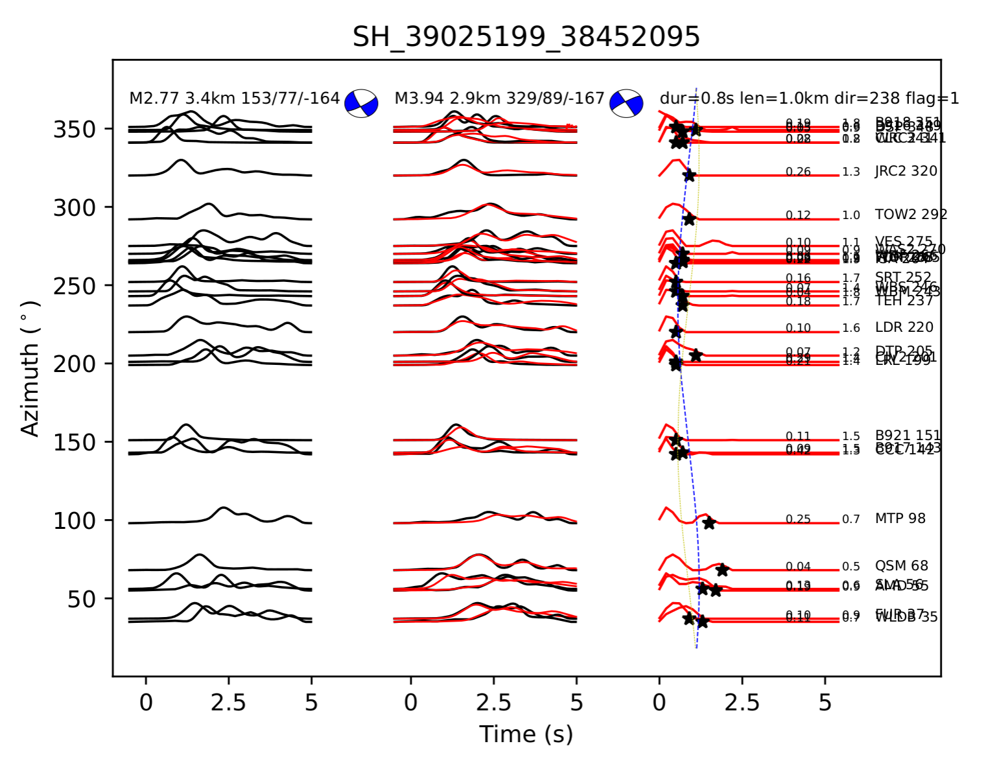

# Earthquake Source Time Function & Directivity Analysis


## Overview

This repository contains a suite of tools for analyzing earthquake rupture directivity using a novel **Energy Envelope Empirical Green's Function (EGF)** deconvolution method.

**Why Energy Envelopes?**
Unlike traditional methods that deconvolve raw displacement or velocity waveforms, this software utilizes the **energy envelopes** of high-frequency seismic waves. 
- **Method:** Envelopes are computed via the Hilbert transform of the seismograms.
- **Advantage:** By discarding the complex and often incoherent phase information of high-frequency waves, this approach offers **significantly better robustness**, particularly for **small earthquakes** (M < 4.0) where scattering effects usually distort phase coherence.

This method isolates the **Source Time Function (STF)** and inverts for rupture properties (length, duration, and direction) by analyzing the azimuthal variation of the STF duration (Doppler effect).

### Example Output
Below is an example of the deconvolution result and directivity fit (Target Event: 38452095, EGF: 39025199):


*(Left: Energy envelope fits at different azimuths; Right: STF duration vs. Azimuth fitting)*

## Reference

This code implements the methodology described in the following paper. If you use this software in your research, please cite:

> **Jia, Z., Fan, W., & Shearer, P. (in press).** > *Rupture directivity from energy envelope deconvolution: theory and application to 58 Ridgecrest M 3.5-5.5 earthquakes.*

## Features

- **Energy-Based Deconvolution:** Utilizes squared envelopes ($s^2(t) + \mathcal{H}(s(t))^2$) to stabilize source inversions for small events.
- **Robust Inversion:** Uses **Non-Negative Least Squares (NNLS)** with smoothing regularization to ensure physical source time functions.
- **Automated Workflow:** Shell scripts and Python modules handle data staging, processing, and cleanup automatically.
- **Directivity Modeling:** Fits a unilateral rupture model to the azimuthal duration data.

## Methodology

The code assumes a unilateral rupture model. The apparent duration $T$ at a station varies with azimuth $\theta$ according to the Doppler effect:

$$T(\theta) = T_0 - \frac{L}{v_r} \cos(\theta - \phi)$$

Where:
- $T_0$: True source duration
- $L$: Rupture length
- $v_r$: Rupture velocity
- $\phi$: Rupture direction

## File Structure

The project is organized to separate code, input data, and results:

```text
.
├── bin/                   # Core Python scripts
│   ├── get_p_waves.py     # Preprocessing, SNR, & Envelope calculation
│   └── invert_rupture.py  # Deconvolution & inversion logic
├── utils/                 # Helper tools
│   └── to_conjugate.awk   # Focal mechanism conversion
├── example_data/          # Place your raw SAC files (*.HHT) here
├── run_analysis.sh        # Main driver script
└── README.md              # Documentation

```

## Prerequisites

SAC (Seismic Analysis Code): Required for header manipulation (sac, saclst).
Gawk: GNU Awk for text processing.
Python 3.x with the following dependencies:

## Usage

1. Data Setup
Place your SAC waveform files in the example_data/ directory.

Naming Convention: ${EventID}.*HHT (e.g., 38450000.CI.CCC.HHT)

Requirements: Files must have valid S-wave arrival picks in the t1 header.

2. Configuration
The run_analysis.sh script is pre-configured to look for data in example_data/. You may need to update the paths to your focal mechanism database (usedeventfm.dat) inside the script.

3. Execution
Run the driver script with the EGF Event ID and the Target Event ID:

Bash

chmod +x run_analysis.sh

./run_analysis.sh 39025199 38452095

4. Outputs
After execution, results are automatically organized into the output/ directory:

output/figures/: PDF plots of waveform fits and directivity curves.

output/data/: Text files containing inversion results (results.dat).

output/logs/: Intermediate processing files.

## License
MIT License

## Contact
Zhe Jia [zjia@ig.utexas.edu]
